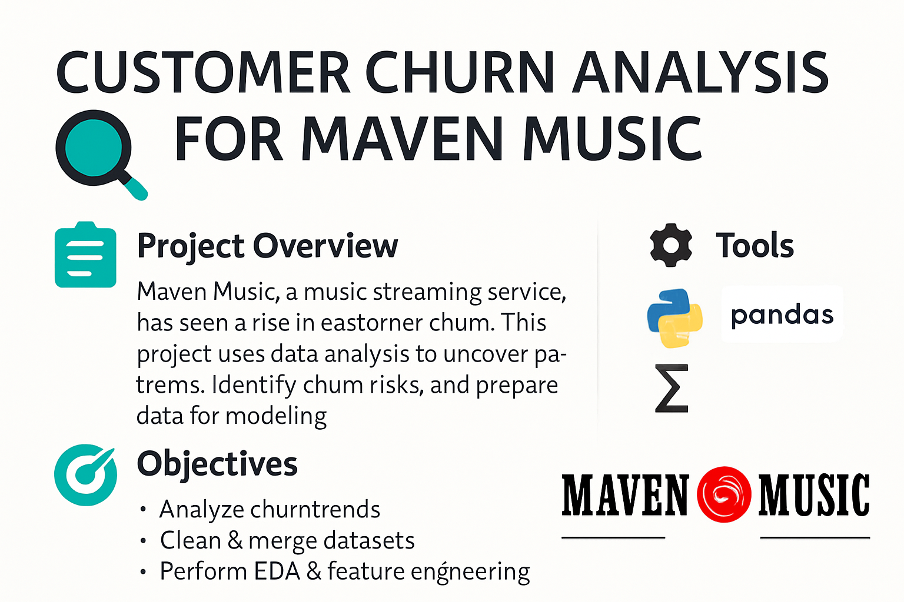

# Customer-Churn-Analysis-for-Maven-Music
<!-- PROJECT BANNER -->
<p align="center">
  
</p>

<!-- PROJECT BADGES -->
<p align="center">
  
  
  
  
</p>

<h1 align="center">🎵 Maven Music Customer Churn Analysis</h1>

---

## 📌 Project Overview
Maven Music, a leading music streaming platform, has seen a rise in customer churn.  
This project applies data analysis to:
- Understand patterns in customer behavior
- Identify churn risks
- Prepare a clean dataset for predictive modeling

---

## 🎯 Objectives
- Analyze churn trends and customer usage patterns  
- Clean and merge subscription & listening history datasets  
- Perform EDA and engineer predictive features  
- Create a modeling-ready dataset  
- Provide data-driven recommendations to improve retention  

---

## 📂 Dataset
- **Customer Data** – Subscription details, demographics, churn status  
- **Listening Data** – Track history, artist preferences, session data  

> ⚠️ Data is from Maven Music case study and not publicly available.

---

## 🛠 Tools & Libraries
- **Python** – Pandas, NumPy, Matplotlib, Seaborn  
- **Jupyter Notebook** – Data exploration & visualization  
- **GitHub** – Version control and hosting  

---

## 📊 Project Workflow
1. **Data Gathering** – Load and inspect datasets  
2. **Data Cleaning** – Handle missing values, fix data types, remove inconsistencies  
3. **Data Merging** – Join customer & listening history tables  
4. **Feature Engineering** – Create new variables to enhance churn prediction  
5. **EDA** – Visualize patterns and trends  
6. **Final Dataset** – Numeric, non-null, modeling-ready DataFrame  

---

## 📈 Key Insights
- Customers with limited engagement are more likely to churn  
- Certain subscription types have higher retention rates  
- Diverse listening habits reduce churn risk  
- Feature-engineered variables improved potential model performance  

---

## 📜 Repository Structure
📂 Maven-Music-Churn-Analysis
├── 📁 data # Raw and cleaned datasets
├── 📁 images # Visualizations & cover photo
├── Maven-Music-Churn-Analysis.ipynb # Main analysis notebook
├── README.md # Project description

yaml
Copy
Edit

---

## 🚀 How to Use
```bash
# Clone repository
git clone https://github.com/YourUsername/Maven-Music-Churn-Analysis.git

# Navigate to folder
cd Maven-Music-Churn-Analysis

# Open Jupyter Notebook
jupyter notebook Project.ipynb

```
📬 Contact
Fouzia Ashfaq
📧 [fouziaashfaq0298@gmail.com]


